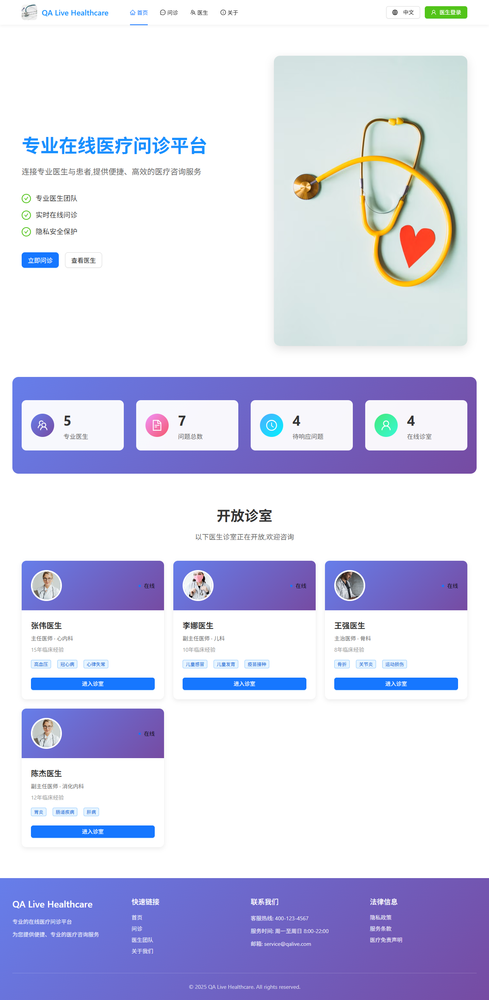
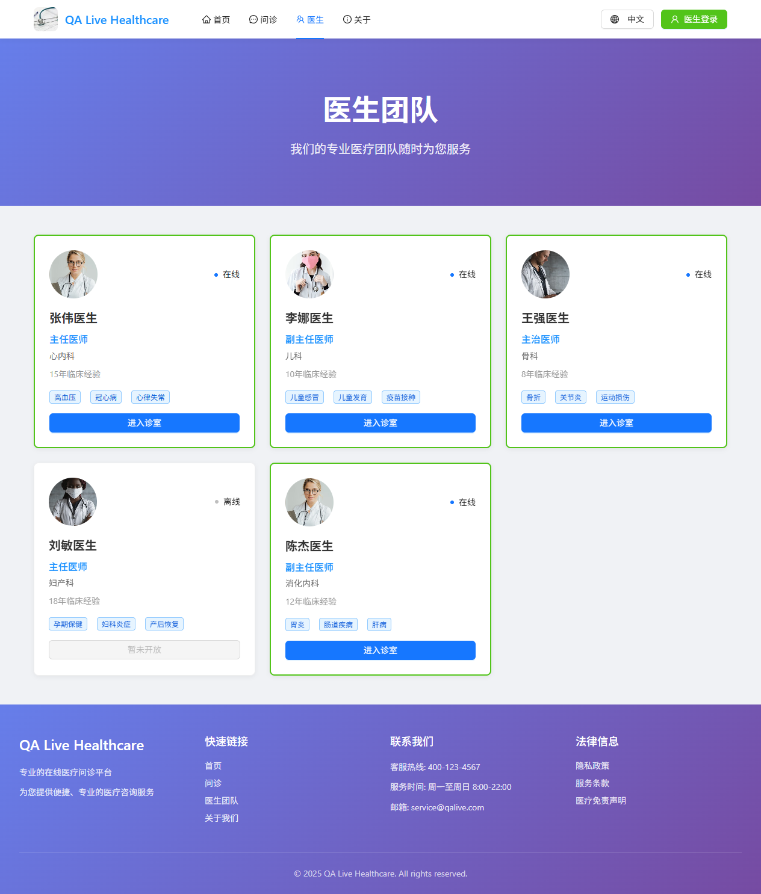

# QA Live Healthcare

基于 Spring Boot + Vue 3 的在线医疗问诊系统，提供医生信息管理与展示功能。

## 项目结构

```
qa-live-healthcare-interview/
├── server/                          # 后端服务
│   ├── qa-service-user/             # 用户 & 医生管理微服务
│   │   ├── src/main/java/com/leansofx/qaserviceuser/
│   │   │   ├── QaServiceUserApplication.java   # 启动入口
│   │   │   ├── controller/          # REST 控制器
│   │   │   ├── service/             # 业务逻辑层
│   │   │   ├── repository/          # JPA 数据访问层
│   │   │   ├── entity/              # 数据库实体
│   │   │   ├── dto/                 # 数据传输对象
│   │   │   └── config/              # 配置类（CORS、Jackson 等）
│   │   ├── src/main/resources/
│   │   │   └── application.properties  # 应用配置
│   │   └── pom.xml                  # Maven 依赖
│   ├── qa-service-question/         # 问诊管理微服务（预留）
│   ├── init.sql                     # 数据库初始化脚本
│   └── check_db.sql                 # 数据库检查 SQL
├── web/
│   └── qa-web/                      # 前端项目
│       ├── src/
│       │   ├── views/               # 页面组件
│       │   │   ├── Home.vue         # 首页
│       │   │   └── Doctors.vue      # 医生列表页
│       │   ├── locales/             # 国际化语言资源
│       │   ├── router/              # 路由配置
│       │   └── stores/              # 状态管理
│       ├── package.json
│       └── vite.config.ts
├── tests/                           # API 测试脚本
│   ├── api_test.sh                  # Linux/macOS 测试脚本
│   └── api_test_windows.bat         # Windows 测试脚本
├── docs/
│   └── api.md                       # API 接口文档
├── docker-compose.yml               # Docker 容器编排
├── start-backend.bat                # 后端一键启动脚本（Windows）
├── run_api_tests.bat                # API 测试运行脚本
├── run_api_tests.ps1                # API 测试运行脚本（PowerShell）
└── API_TEST.md                      # API 测试说明文档
```

## 技术栈

### 后端
| 技术 | 版本 | 说明 |
|------|------|------|
| Java | 17 | 运行环境 |
| Spring Boot | 3.5.7 | 核心框架 |
| Spring Data JPA | - | ORM 数据访问 |
| MySQL | 8.0 | 关系型数据库 |
| Maven | - | 构建工具 |
| Docker Compose | 3.8 | 容器编排 |

### 前端
| 技术 | 版本 | 说明 |
|------|------|------|
| Vue | 3.x | 前端框架 |
| TypeScript | 5.x | 类型安全 |
| Vite | 5.x | 构建工具 |
| Ant Design Vue | 4.x | UI 组件库 |
| Vue Router | 4.x | 前端路由 |
| Day.js | 1.x | 日期处理 |

## 快速开始

### 环境要求

- **JDK 17** 或以上
- **Node.js 18** 或以上
- **Docker Desktop**（用于运行 MySQL）
- **Maven**（或使用项目自带的 Maven Wrapper）

### 1. 克隆项目

```bash
git clone <your-repo-url>
cd qa-live-healthcare-interview
```

### 2. 启动 MySQL 数据库

```bash
docker-compose up -d
```

这将启动两个容器：
- **MySQL 8.0** — 数据库服务，端口 `3307`
- **phpMyAdmin** — 数据库管理界面，端口 `8081`

> phpMyAdmin 访问地址：http://localhost:8081
> 用户名：`qa_user`，密码：`qa_password`

数据库初始化脚本 `server/init.sql` 会在容器首次启动时自动执行，创建 `doctors` 表并插入 5 条初始医生数据。

### 3. 启动后端服务

**Windows：**

双击运行 `start-backend.bat`，或在命令行中：

```bash
cd server\qa-service-user
mvnw.cmd spring-boot:run
```

**Linux / macOS：**

```bash
cd server/qa-service-user
./mvnw spring-boot:run
```

后端服务启动后访问地址：`http://localhost:8080`

### 4. 启动前端项目

```bash
cd web/qa-web
npm install
npm run dev
```

前端开发服务器默认运行在 `http://localhost:5173`

### 5. 运行 API 测试

```bash
# Windows
run_api_tests.bat

# 或使用 PowerShell
run_api_tests.ps1

# Linux / macOS
cd tests && ./api_test.sh
```

## API 接口

所有接口基础路径：`http://localhost:8080/api`

### 医生管理

| 方法 | 路径 | 说明 |
|------|------|------|
| GET | `/api/doctors` | 获取所有医生列表 |
| GET | `/api/doctors/active` | 获取活跃医生列表 |
| GET | `/api/doctors/{id}` | 根据 ID 获取医生详情 |
| GET | `/api/doctors/username/{username}` | 根据用户名获取医生 |
| POST | `/api/doctors` | 创建新医生 |
| PUT | `/api/doctors/{id}` | 更新医生信息 |
| DELETE | `/api/doctors/{id}` | 删除医生 |
| GET | `/api/doctors/health` | 医生接口健康检查 |

### 系统端点

| 方法 | 路径 | 说明 |
|------|------|------|
| GET | `/api/test` | 基础连通性测试 |
| GET | `/api/test/cors` | CORS 跨域测试 |
| GET | `/actuator/health` | 应用健康检查 |
| GET | `/actuator/info` | 应用信息 |

### 统一响应格式

```json
{
  "code": 200,
  "message": "Success",
  "data": { ... },
  "timestamp": "2026-02-08T12:00:00"
}
```

详细 API 文档请参阅 [docs/api.md](docs/api.md)。

## 数据库

### 连接信息

| 配置项 | 值 |
|--------|-----|
| 主机 | localhost |
| 端口 | 3307 |
| 数据库 | qa_healthcare |
| 用户名 | qa_user |
| 密码 | qa_password |
| 字符集 | utf8mb4 |

### doctors 表结构

| 字段 | 类型 | 说明 |
|------|------|------|
| id | VARCHAR(50) | 主键，医生 ID |
| username | VARCHAR(50) | 唯一，登录用户名 |
| password | VARCHAR(100) | 密码 |
| name | VARCHAR(100) | 姓名 |
| title | VARCHAR(50) | 职称 |
| department | VARCHAR(50) | 科室 |
| avatar | TEXT | 头像 URL |
| experience | VARCHAR(100) | 从业经验 |
| specialties | JSON | 专业特长列表 |
| is_active | BOOLEAN | 是否活跃 |
| created_at | TIMESTAMP | 创建时间 |
| updated_at | TIMESTAMP | 更新时间 |

## 页面截图

### 首页



首页展示医疗问诊平台入口，右上角提供语言切换下拉菜单，支持中文 / English 动态切换。

### 医生列表



医生列表从后端 MySQL 数据库获取数据，展示医生的姓名、职称、科室、专业特长等信息。

## 前端页面

| 路由 | 页面 | 说明 |
|------|------|------|
| `/` | Home | 首页，支持中英文切换 |
| `/doctors` | Doctors | 医生列表，从后端 API 获取数据 |

## 常用命令

```bash
# 启动 Docker 服务
docker-compose up -d

# 查看 Docker 容器状态
docker-compose ps

# 查看数据库日志
docker logs qa-healthcare-mysql

# 停止并移除 Docker 容器
docker-compose down

# 后端 Maven 打包
cd server/qa-service-user
./mvnw clean package

# 前端构建
cd web/qa-web
npm run build
```

## 故障排查

### 数据库连接失败

1. 确认 Docker 容器正在运行：`docker ps`
2. 检查端口是否被占用：`netstat -ano | findstr 3307`
3. 查看容器日志：`docker logs qa-healthcare-mysql`

### 后端启动报错

1. 确认 JDK 17 已安装：`java -version`
2. 确认 MySQL 容器已启动并正常运行
3. 查看后端控制台日志中的具体错误信息

### 前端调用 API 跨域问题

后端已配置全局 CORS，允许所有来源访问。如果仍然出现跨域问题，请检查后端是否正常运行在 `8080` 端口。

## 许可证

本项目仅用于学习与演示目的。
